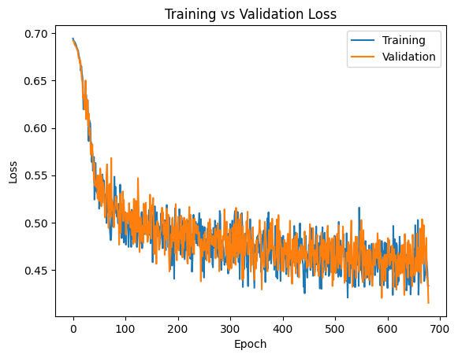
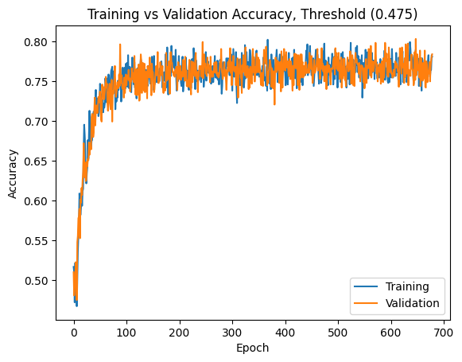
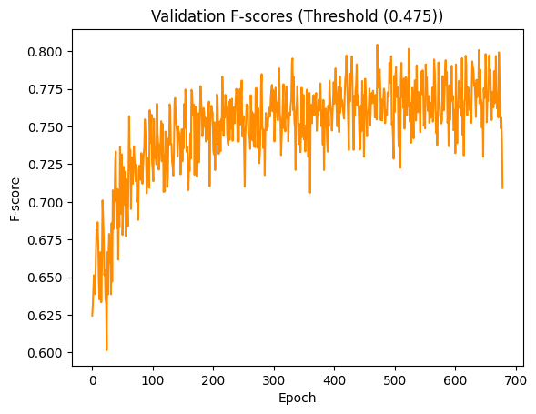
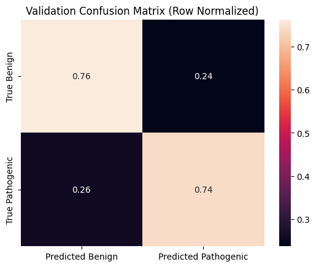
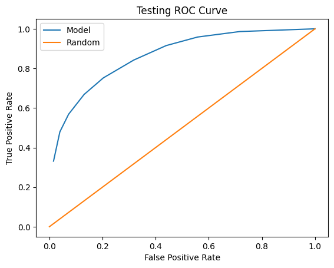
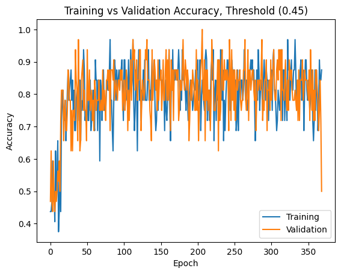
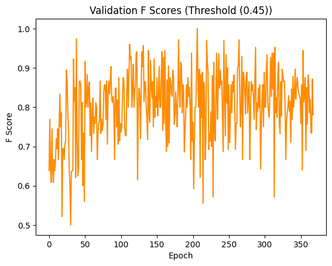
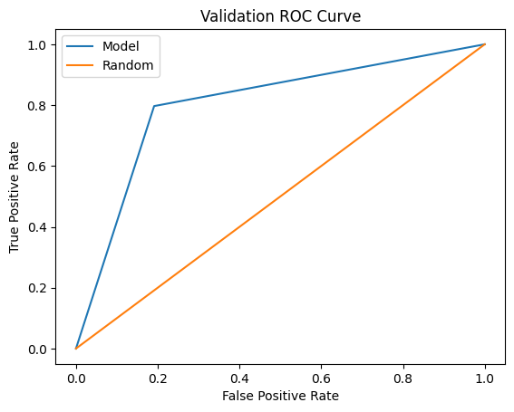
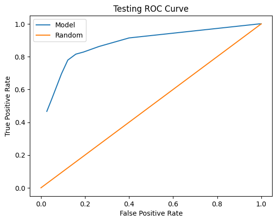
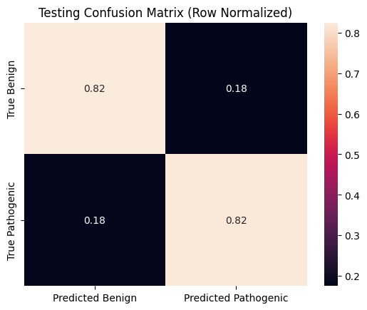

# Gene Variation Classifier

A machine learning pipeline aiming to identify and classify variations in genes to identify pathogenic or benign variations.

## Contributors
- Jeffrey Bringolf
- Olivier Demers

## What does this repository contain?
This repository has many files which aren't laid out here, but the key files for running and understanding the dataset are outlined below.

```markdown
├── gene_variation_effects          <- Contains files and classes used in the notebooks.
|  └── dataset.py                   <- Cleans data from a specified data folder and creates the input for the pipeline
|  └── model                        <- Contains classes used for training
|       └── modelarchitectures.py   <- Our custom neural network class
|       └── pipelines.py            <- Our custom data pipeline
|       └── train.py                <- Contains the training loop
|
├── models                          <- Contains weights for our different models
|  └── BRCA1model.pth               <- The model used to classify variations exclusively found on the BRCA1 gene
|  └── model.pth                    <- The model used to classify variations across genes
|
├── notebooks                       <- Contains the notebooks used for training and analysis
|  └── main.ipynb                   <- Contains the training and analysis for variation classification across genes
|  └── BRCA1.ipynb                  <- Contains the training and analysis for variation classification exclusively found in BRCA1
|
├── references                      <- Contains reference files
|  └── dict.txt                     <- Data dictionary for the ClinVar variations dataset
```

## Data Processing

### Dataset

We trained our neural networks on a relatively small number of features due to the limited number of seemingly meaningful fields in the ClinVar dataset. See [Dataset](#dataset) for the specific datasets used. These fields are 
- Type: Indicates the type of variation (indel, deletion, insertion, ...)
- (Cross-Gene Only) GeneSymbol: Indicates which gene this variation was found in.
- VariantLength: The number of nucleotide bases affected by this variation.
- VariantLengthDifference: The difference between the length of the alternate allele, and the reference allele.
- OriginGermline: Calculated field indicating whether the origin of the variation of germline. The alternative (negative) is that the origin is somatic.
- (BRCA1 Only) PhyloScore: The conservation score for this variation sourced from the PhyloP 100 way bigwig file.
- (BRCA1 Only) ConvervationDisruption: Calculated field capturing the significance of a disruption to a highly conserved gene section. ConvervationDisruption is the product of PhyloScore and VariantLength.
- (BRCA1 Only) DistanceFromEnd: The shortest distance from the start or end of the variation to the start or end of the gene. This is potentially insightful since variations at the start or end of genes tend to be more pathogenic.
- (BRCA1 Only) RelativeStart: The distance from the start of the gene to the start of the variation (normalized to the size of the gene)

## Findings
Despite the limited number of fields, and their relatively low correlation with pathogenicity -- with our most correlated numeric features being OriginGermline for general variations with a -0.17 Pearson correlaton coefficient, and PhyloScore with a 0.285 for BRCA1 variations -- our model manages to classify variatons significantly more accurately than a random model.


### General Variation Classification
Our general variation classification model achieved an F-Score of ~76% and an accuracy of 77% on our balanced test dataset. We can see from our loss, F-score and accuracy graphs, that our model is clearly learning. Relevant graphs are shown below. Additionally, the model's ROC curve indicates that is performs meaningfully better than a random classifier, and the related correlation matrices demonstrate a reasonable trade-off between false positives and false negatives. This could be further skewed depending on desired behaviour by modifying the prediction threshold.









### BRCA1 Variation Classification
Our BRCA1 variation classification model achieved an F-Score of 81.5% and an accuracy of 82.5% on our balanced test dataset. We can see from our loss, F-score and accuracy graphs, that our model is clearly learning. However, in this restrictive case, our model achieves its optimal accuracy and loss significantly earlier than in the general case. This is likely due to the fact that the predictive landscape becomes significantly more complex when trying to predict across different genes. Relevant graphs are shown below. Additionally, the model's ROC curve indicates that is performs meaningfully better than a random classifier, and the related correlation matrices demonstrate a reasonable trade-off between false positives and false negatives. This could be further skewed depending on desired behaviour by modifying the prediction threshold.









## Future Work
Building upong this project, we would like to introduce a larger feature set by using more datasets. The inclusion of the PhyloP dataset significantly improved the performance of the BRCA1 model, and we believe that adding further data such as the frequency of a given variation in a population would drastically improve the model's performance as well.

We would also like to compare this model to different architectures to see what kind of solution is best for this particular problem. This would also give further insights into metrics like the ROC curve and F-score, which are particularly useful for comparison accross different architectures.

We would also like to compare the performance of our model on different genes. Due to the limited number of data points for the BRCA1 variations, we added additional features to the BRCA1 dataset to achieve a good performance. However, we can not tell if the lack of performance was due to a limited dataset, a lack of highly correlated features, or an intrinsic property of the BRCA1 gene which makes variation classification particularly difficult within it. Including additional features into our general model, and limiting test datasets to different genes could pinpoint the genes on which out model struggles, and potentially clarify the limitations causing our BRCA1 model to struggle without the additional features.

## License
This project is licensed under the MIT License.

## Dataset 

### ClinVar - Primary dataset containing gene variations and pathogenicity flags
Source: https://ftp.ncbi.nlm.nih.gov/pub/clinvar/tab_delimited/ <br>
File: variant_summary.txt.gz

### PhyloP 100-Way - Secondary dataset used to find conservation scores for BRCA1 variations
Source: https://hgdownload.cse.ucsc.edu/goldenpath/hg38/phyloP100way/ <br>
File hg38.phyloP10way.bw
